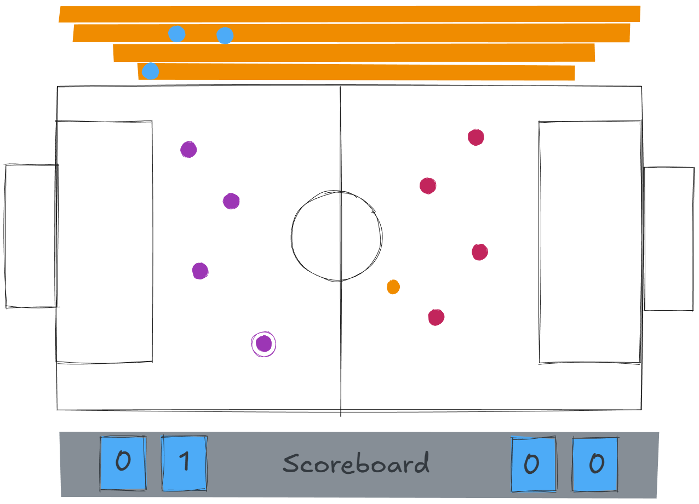
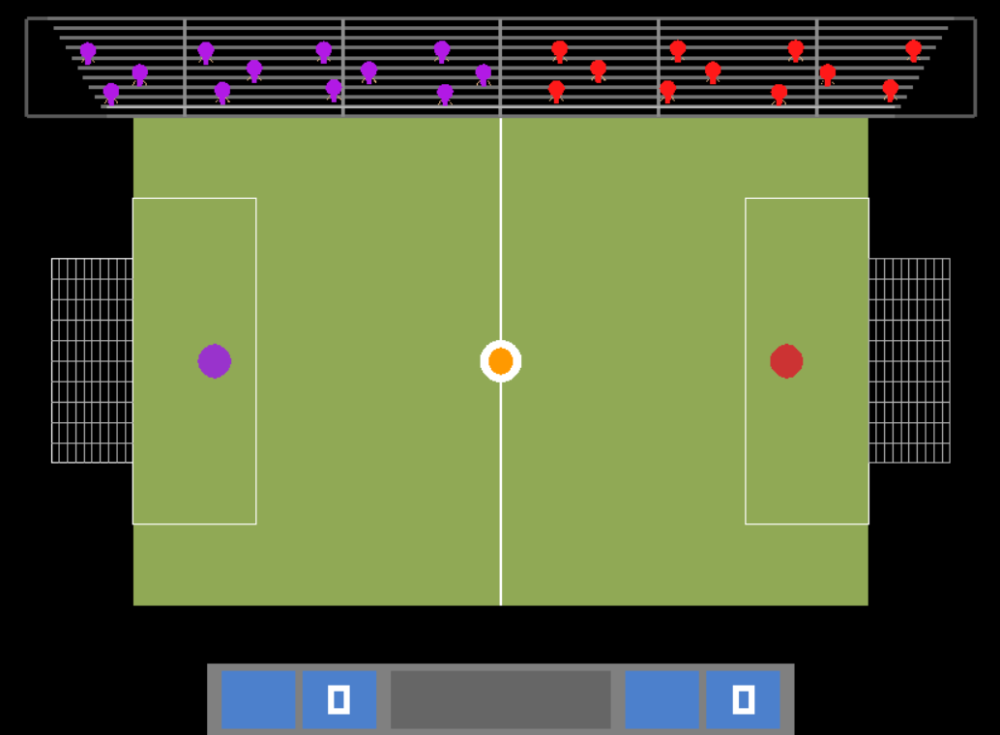
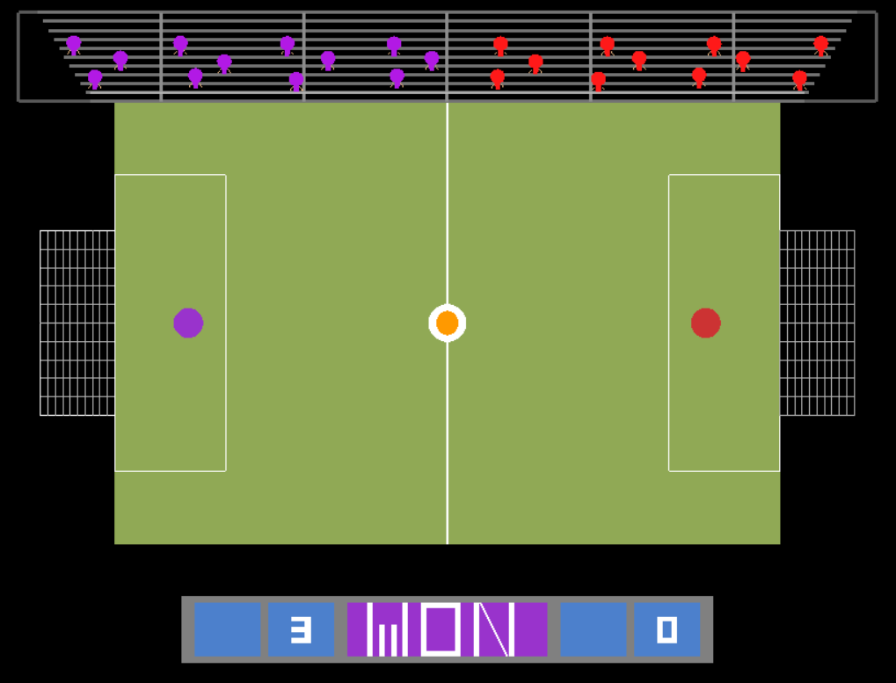

# Mini Football game

----
Simple game based on OpenGL libraries with C++. Player has to score as many goals as possible in a limited time.

## Demo GUI

## Implemented GUI
### Game Start

### Game won

## Controls
- r - Restart Game
- esc - Exit Game

### Player1
- W - Move top
- S - Move bottom
- A - Move Left
- D - Move Right

### Player2
- i - Move top
- k - Move bottom
- j - Move Left
- l - Move Right

## Features
### GUI
- Two Players can play simultaneously
- Scoreboard that updates in real time
- Scene gets reset after goal
- First player to reach 3 goals wins
- Game stops after a win, 'r' to restart
- Scoreboard indicates winner color with 'WIN' text
- Audience animation
- Collision detection with ball
- Collision detection with goal post and field boundaries
### Project Directories
- assets/: contains images used in the game
- external/: contains external libraries used in the project (freeglut)
- include/entities: contains c++ header files for this project
- src/entities: contains c++ source files for this project
- src/: contains only main.cpp
- CMakeLists.txt: cmake configuration file

## Future Improvements
- Add sound effects
- Add more players with AI
- A control board displaying controls for better GUI

## For teammates
- Install JetBrains Toolbox
- Open Toolbox and install CLion
- Clone the project
- copy the bin/freeglut.dll to your mingw\bin folder
- copy the lib/libfreeglut.a & lib/libfreeglut_static.a to your mingw\lib folder
- switch to feature/ branch to make push
- None can push to main directly

## Group Members
| Name               | ID         |
|--------------------|------------|
| SHIFAT ARMAN SHIAM | 23-50945-1 |
| MD SADIK SHEIKH    | 23-50948-1 |
| AVARA BINTE SHAMS  | 23-50983-1 |
| ARPON MOLLICK      | 23-50061-1 |
